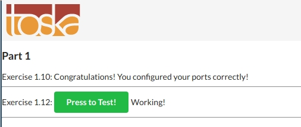
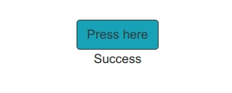
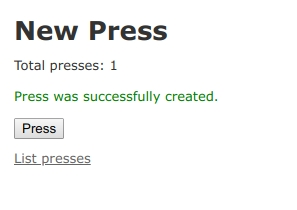

# Part 1

Docker version 19.03.4-ce, build 9013bf583a

## 1.1
```
docker run -d --name nginx_1 nginx:alpine
docker run -d --name nginx_2 nginx:alpine
docker run -d --name nginx_3 nginx:alpine
docker stop nginx_1 nginx_2
```

Run `docker ps -a`:
```
CONTAINER ID        IMAGE               COMMAND                  CREATED              STATUS                          PORTS               NAMES
83b9125a9146        nginx:alpine        "nginx -g 'daemon of…"   32 seconds ago       Up 28 seconds                   80/tcp              nginx_3
f7af1c226e2c        nginx:alpine        "nginx -g 'daemon of…"   38 seconds ago       Exited (0) 16 seconds ago                           nginx_2
02e706dc6d5b        nginx:alpine        "nginx -g 'daemon of…"   About a minute ago   Exited (0) 16 seconds ago                           nginx_1
```

## 1.2
```
docker stop nginx_3
docker rm nginx_1 nginx_2 nginx_3
docker rmi nginx:alpine
```

Run `docker ps -a`:
````
CONTAINER ID        IMAGE               COMMAND             CREATED             STATUS              PORTS               NAMES
````

Run `docker images`. `nginx:alpine` no longer exists.
```
REPOSITORY          TAG                 IMAGE ID            CREATED             SIZE
redis               alpine              d975eaec5f68        3 months ago        51.1MB
```

## 1.3
Input: `basics`

- Run `docker run -it devopsdockeruh/pull_exercise`
- Look at the Dockerfile of `devopsdockeruh/pull_exercise`: [Dockerfile](https://hub.docker.com/r/devopsdockeruh/pull_exercise/dockerfile) and see that the container runs `index.js`.
- Go to [index.js](https://github.com/docker-hy/docs-exercise/blob/master/index.js). `This is the secret message` only appears when `basics` is inserted.

## 1.4
```
docker run -d --name spider_man devopsdockeruh/exec_bash_exercise
docker exec -it spider_man /bin/bash
```
Inside the container, run `tail -f ./logs.txt`
```
Wed, 30 Oct 2019 12:04:18 GMT
Secret message is:
"Docker is easy"
Wed, 30 Oct 2019 12:04:24 GMT
Wed, 30 Oct 2019 12:04:27 GMT
Wed, 30 Oct 2019 12:04:30 GMT
```
Secret message: `Docker is easy`

## 1.5

Remove flag `-d` from previous commands and run:
```
docker run --rm -it --name iron_man ubuntu:16.04 sh -c 'echo "Input website:"; read website; echo "Searching.."; sleep 1; curl http://$website;'
```
Type `helsinki.fi` and get the output:
```
Input website:
helsinki.fi
Searching..
sh: 1: curl: not found
```
Since `curl` is not installed, we need to install it by adding `apt update; apt install curl`
```
docker run --rm -it --name iron_man ubuntu:16.04 sh -c 'apt update; apt install curl -y; echo "Input website:"; read website; echo "Searching.."; sleep 1; curl http://$website;'
```
This time it works. However, when inserting `helsinki.fi`, the output is:
```
<!DOCTYPE HTML PUBLIC "-//IETF//DTD HTML 2.0//EN">
<html><head>
<title>301 Moved Permanently</title>
</head><body>
<h1>Moved Permanently</h1>
<p>The document has moved <a href="http://www.helsinki.fi/">here</a>.</p>
</body></html>
```
Since we get 301 HTTP status code, we need to add `-L` to `curl`:
```
docker run --rm -it --name iron_man ubuntu:16.04 sh -c 'apt update; apt install curl -y; echo "Input website:"; read website; echo ""Searching.."; sleep 1; curl -L http://$website;'
```
Now inserting `helsinki.fi` would give a good result:
```
<!DOCTYPE html>
<!--[if IEMobile 7]>
<html class="ie iem7" lang="en"
      dir="ltr"><![endif]-->
<!--[if lte IE 6]>
<html class="ie lt-ie9 lt-ie8 lt-ie7" lang="en"
      dir="ltr"><![endif]-->
<!--[if (IE 7)&(!IEMobile)]>
<html class="ie lt-ie9 lt-ie8" lang="en"
....
```

# 1.6
```
docker build --file Dockerfile_16 --rm -t docker-clock .
docker run docker-clock
```

# 1.7
```
docker build --file Dockerfile_17 --rm -t curler .
docker run -it curler
```

# 1.8
```
touch logs.txt
docker run -d --mount type=bind,source="$(pwd)"/logs.txt,target=/usr/app/logs.txt devopsdockeruh/first_volume_exercise
```

Run `tail -f logs.txt` to view the logs. The secret message is `Volume bind mount is easy`.

# 1.9
```
docker run -d -p 80:80 devopsdockeruh/ports_exercise
```

Visit [http://localhost:80](http://localhost:80) to acacess the contents. The content is `Ports configured correctly!!`.

# 1.10
```
docker build --file Dockerfile_110 --rm -t thor .
docker run -d -p 5000:5000 --name furious_thor --rm thor
```
Now visit [http://localhost:5000/](http://localhost:5000/) and everything is set.

# 1.11
```
docker build --file Dockerfile_111 --rm -t loki .
docker run -d -p 8000:8000 --name tricky_loki --rm --mount type=bind,source="$(pwd)"/logs.txt,target=/backend-example-docker/logs.txt loki
```

Now visit [http://localhost:8000/](http://localhost:8000/) and everything is set.
Run `cat logs.txt`:

```
10/31/2019, 11:24:33 AM: Connection received in root
10/31/2019, 11:24:44 AM: Connection received in root
```

Now stop the container and restart it:
```
docker stop tricky_loki
docker run -d -p 8000:8000 --name tricky_loki --rm --mount type=bind,source="$(pwd)"/logs.txt,target=/backend-example-docker/logs.txt loki
```
The new logs are appended to `logs.txt`:
```
10/31/2019, 11:24:33 AM: Connection received in root
10/31/2019, 11:24:44 AM: Connection received in root
10/31/2019, 11:33:39 AM: Connection received in root
10/31/2019, 11:33:40 AM: Connection received in root
```

# 1.12
Build docker images again with `Dockerfile_112_front` and `Dockerfile_112_back`

```
docker build --file Dockerfile_112_front --rm -t mighty_thor .
docker build --file Dockerfile_112_back --rm -t mighty_loki .
```

Run 2 new containers:
```
docker run -d -p 5000:5000 --name furious_thor --rm mighty_thor
docker run -d -p 8000:8000 --name tricky_loki --rm --mount type=bind,source="$(pwd)"/logs.txt,target=/backend-example-docker/logs.txt mighty_loki
```

Now click `Press to Test!` button in [http://localhost:5000/](http://localhost:5000/) and get the `Working!` message.



# 1.13
```
docker build --file Dockerfile_113 --rm -t captain_america .
docker run -d -p 8080:8080 --rm captain_america
```



# 1.14
```
docker build --file Dockerfile_114 --rm -t black_widow .
docker run -d -p 3000:3000 --rm black_widow
```
Visit [http://localhost:3000](http://localhost:3000):



# 1.15
I build an Alpine image for Nginx, NodeJS and Yarn at [here](https://cloud.docker.com/repository/docker/pexea12/alpine-nginx-yarn-nodejs) (NodeJS 8.9.3, Yarn 1.3.2 and Nginx 1.14.0). The Dockerfile is in [Dockerfile](./Dockerfile_115).

This image is lightweight for any deployment with Nginx and NodeJS, which is suitable for a orchestration tool like Kubernetes. The image size is 64.6MB.

# 1.16
The application is deployed at [pexea12-uoh-docker.herokuapp.com](https://pexea12-uoh-docker.herokuapp.com/).

# 1.17
Build the calculator web application. The repository is at [Bitbucket](https://bitbucket.org/pexea12/calculator)

```
docker build --file Dockerfile_117 --rm -t vision .
```

The image is hosted at [Docker Hub](https://hub.docker.com/r/pexea12/vision).

Run the image:
```
docker run -d -p 5000:5000 --rm vision
```

Visit the web application at [http://0.0.0.0:5000](http://0.0.0.0:5000).
