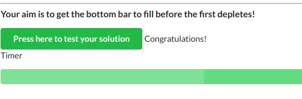
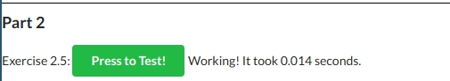

# Part 2

## 2.1
Working directory: [./part-2/2-01](./part-2/2-01)

```
touch logs.txt
docker-compose up -d
```

## 2.2
Working directory: [./part-2/2-02](./part-2/2-02)
```
docker-compose up -d
```

## 2.3
Working directory: [./part-2/2-03](./part-2/2-03)

```
docker-compose up -d
```

## 2.4
Working directory: [./scaling-exercise](./scaling-exercise)

```
docker-compose up -d --scale compute=3
```



## 2.5
Working directory: [./part-2/2-05](./part-2/2-05)

```
docker-compose up -d
```



## 2.6
Working directory: [./part-2/2-06](./part-2/2-06)

## 2.7

## 2.8

## 2.9

## 2.10
