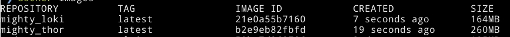
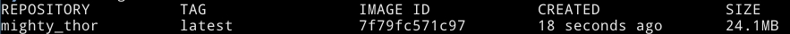

# Part 3

## 3.1

Current frontend and backend image from [1.12](./part-1#112) are 260MB and 164MB respectively.



Working directory: [./part-3/3-01](./part-3/3-01).

To optimize the frontend image, we will use Docker multi-stage build to build a production version and use `nginx` to serve static files and remove the rest of the source code: [Dockerfile](./part-3/3-01/Dockerfile_front)

```
docker build --file Dockerfile_front --rm -t mighty_thor ../..
```

The new image is only 24.1MB now. Since we are using nginx now, the frontend will now run on port 80.

```
docker run -d -p 5000:80 --name furious_thor --rm mighty_thor
docker run -d -p 8000:8000 --name tricky_loki --rm mighty_loki
```



## 3.2
Working directory: [./part-3/3-02](./part-3/3-02)

```
docker build --rm -t moomin .
```

The image size is 234MB.

Download an audio file usign `moomin`:

```
docker run -v $(pwd)/audios:/app moomin "https://areena.yle.fi/1-50325682"
```

## 3.3
Working directory: [./part-3/3-03](./part-3/3-03)

```
docker build --file Dockerfile_front --rm -t mighty_thor ../..
docker build --file Dockerfile_back --rm -t mighty_loki ../..
```

Run the containers:

```
docker run -d -p 5000:5000 --name furious_thor --rm mighty_thor
docker run -d -p 8000:8000 --name tricky_loki --rm mighty_loki
```

## 3.4

Current Dockerfiles in [./part-3/3-03](./part-3/3-03) are already using Alpine. The frontend image is 24.1MB and the backend image is 164MB.

## 3.5

Current Dockerfile of frontend is using Multi-stage builds. [Dockerfile](./part-3/3-03/Dockerfile_front).

## 3.6

Working directory: [./part-3/3-07](./part-3/3-07).
Optimize the calculator image in [part-1](./part-1#117).

- Before optimization: [Dockerfile](./part-3/3-07/Dockerfile_before). The image size is 115MB.
    ```
    docker build --file Dockerfile_before --rm -t vision_before ../..
    ```

- After optimization: [Dockerfile](./part-3/3-07/Dockerfile_after). The image size is 23.7MB.
    ```
    docker build --file Dockerfile_after --rm -t vision_after ../..
    ```
