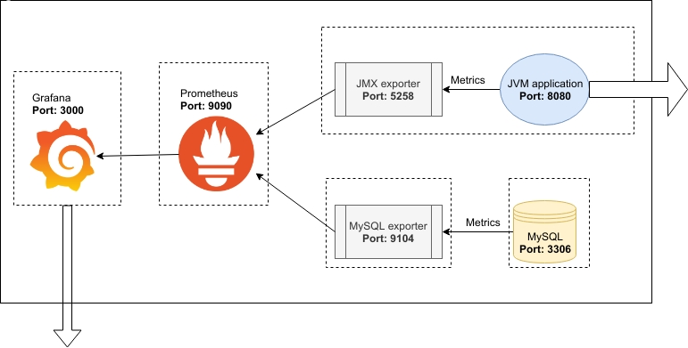

# Part 3

## 3.1

Current frontend and backend image from [1.12](./part-1#112) are 260MB and 164MB respectively.


Working directory: [./part-3/3-01](./part-3/3-01).

To optimize the frontend image, we will use Docker multi-stage build to build a production version and use `nginx` to serve static files and remove the rest of the source code: [Dockerfile](./part-3/3-01/Dockerfile_front)

```
docker build --file Dockerfile_front --rm -t mighty_thor ../..
```

The new image is only 24.1MB now. Since we are using nginx now, the frontend will now run on port 80.

```
docker run -d -p 5000:80 --name furious_thor --rm mighty_thor
docker run -d -p 8000:8000 --name tricky_loki --rm mighty_loki
```


## 3.2
Working directory: [./part-3/3-02](./part-3/3-02)

```
docker build --rm -t moomin .
```

The image size is 234MB.

Download an audio file usign `moomin`:

```
docker run -v $(pwd)/audios:/app moomin "https://areena.yle.fi/1-50325682"
```

## 3.3
Working directory: [./part-3/3-03](./part-3/3-03)

```
docker build --file Dockerfile_front --rm -t mighty_thor ../..
docker build --file Dockerfile_back --rm -t mighty_loki ../..
```

Run the containers:

```
docker run -d -p 5000:5000 --name furious_thor --rm mighty_thor
docker run -d -p 8000:8000 --name tricky_loki --rm mighty_loki
```

## 3.4

Current Dockerfiles in [./part-3/3-03](./part-3/3-03) are already using Alpine. The frontend image is 24.1MB and the backend image is 164MB.

## 3.5

Current Dockerfile of frontend is using Multi-stage builds. [Dockerfile](./part-3/3-03/Dockerfile_front).

## 3.6

Working directory: [./part-3/3-07](./part-3/3-07).
Optimize the calculator image in [part-1](./part-1#117).

- Before optimization: [Dockerfile](./part-3/3-07/Dockerfile_before). The image size is 115MB.
    ```
    docker build --file Dockerfile_before --rm -t vision_before ../..
    ```

- After optimization: [Dockerfile](./part-3/3-07/Dockerfile_after). The image size is 23.7MB.
    ```
    docker build --file Dockerfile_after --rm -t vision_after ../..
    ```

## 3.8

Create an example setup that uses Kubernetes, Docker Swarm or equivalent using any project and deploy it online. You can use any applications available to you (such as the frontend - backend example). Make sure that the application consists of atleast two different containers that are deployed on two different hosts. Explain what you created in your submission.

I will use Kubernetes to set up a monitor system using Grafana and Prometheus to track MySQL and JVM.




1. Install [kubectl](https://kubernetes.io/docs/tasks/tools/install-kubectl/) and [aws-cli](http://docs.aws.amazon.com/cli/latest/userguide/installing.html).
2. Install [kops](https://kubernetes.io/docs/setup/production-environment/tools/kops/). `kops` helps you create, destroy, upgrade and maintain production-grade, highly available, Kubernetes clusters from the command line.
3. Follow this [instruction](https://github.com/kubernetes/kops/blob/master/docs/getting_started/aws.md) to create a IAM user on AWS.
4. Configure DNS for the domain by following the [instruction](https://github.com/kubernetes/kops/blob/master/docs/getting_started/aws.md#configure-dns). In this case, I will use my subdomain `k8s.jebetech.online`.

```
ID=$(uuidgen) && aws route53 create-hosted-zone --name k8s.jebetech.online --caller-reference $ID | jq .DelegationSet.NameServers
```
Output:
```
[
  "ns-1269.awsdns-30.org",
  "ns-1644.awsdns-13.co.uk",
  "ns-111.awsdns-13.com",
  "ns-819.awsdns-38.net"
]
```

```
aws route53 list-hosted-zones | jq '.HostedZones[] | select(.Name=="jebetech.online.") | .Id'
```
Output:
```
/hostedzone/Z3KWWM38J8231S
```

Create a new JSON file (`k8s.json`) with these data:
```
{
  "Comment": "Demo k8s",
  "Changes": [
    {
      "Action": "CREATE",
      "ResourceRecordSet": {
        "Name": "k8s.jebetech.online",
        "Type": "NS",
        "TTL": 300,
        "ResourceRecords": [
          {
            "Value": "ns-1269.awsdns-30.org"
          },
          {
            "Value": "ns-1644.awsdns-13.co.uk"
          },
          {
            "Value": "ns-111.awsdns-13.com"
          },
          {
            "Value": "ns-819.awsdns-38.net"
          }
        ]
      }
    }
  ]
}
```

Apply the sub-domain NS record to the parent hosted zone:
```
aws route53 change-resource-record-sets \
 --hosted-zone-id Z3KWWM38J8231S \
 --change-batch k8s.json
```

Output:
```
{
    "ChangeInfo": {
        "Id": "/change/C34YUVWC1RVQH2",
        "Status": "PENDING",
        "SubmittedAt": "2019-11-10T12:26:18.261000+00:00",
        "Comment": "Demo k8s"
    }
}
```

5. Create a dedicated S3 bucket to store k8s assets: [Cluster State Storage](https://github.com/kubernetes/kops/blob/master/docs/getting_started/aws.md#cluster-state-storage)
```
aws s3api create-bucket \
    --bucket kops-uh-s3 \
    --region us-east-1
```

6. Create a configuration file `kops.env` for the clusters
```
export NAME=k8s.jebetech.online
export KOPS_STATE_STORE=s3://kops-uh-s3
```

Then source the env file:
```
source kops.env
```

7. Create a cluster:
```
kops create cluster \
    --zones=ap-southeast-1a \
    --cloud=aws
    --node-count=4
    --name=${NAME}
    --yes
```

Now run `kops validate cluster` and all 4 nodes are up:
```
Using cluster from kubectl context: k8s.jebetech.online

Validating cluster k8s.jebetech.online

INSTANCE GROUPS
NAME                    ROLE    MACHINETYPE     MIN     MAX     SUBNETS
master-ap-southeast-1a  Master  m3.medium       1       1       ap-southeast-1a
nodes                   Node    t2.medium       4       4       ap-southeast-1a

NODE STATUS
NAME                                                    ROLE    READY
ip-172-20-35-60.ap-southeast-1.compute.internal         master  True
ip-172-20-43-139.ap-southeast-1.compute.internal        node    True
ip-172-20-45-85.ap-southeast-1.compute.internal         node    True
ip-172-20-49-41.ap-southeast-1.compute.internal         node    True
ip-172-20-62-100.ap-southeast-1.compute.internal        node    True
```


